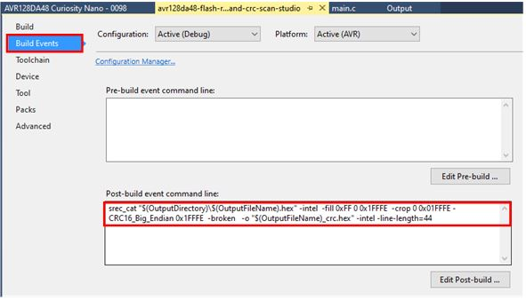
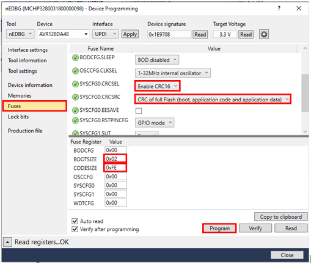
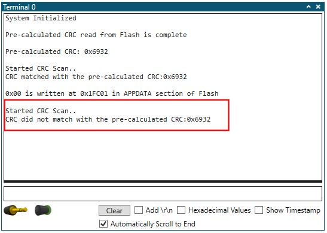

<!-- Please do not change this html logo with link -->

# CRC SCAN ON FLASH MEMORY
  
Cyclic Redundancy Check Memory Scan (CRCSCAN) peripheral  is a Core Independent Peripheral (CIP) which can be configured to run without any intervention from the CPU after initialization. CRCSCAN peripheral is used to detect faults in the target section of the Flash and to ensure no code corruption has occurred in Flash memory. 

This example demonstrates usage of CRCSCAN peripheral to perform CRC operation on the Flash memory and Nonvolatile Memory Controller (NVMCTRL) peripheral to perform read and write operations on the Flash memory in runtime.

**Note:** *This example is valid for all the AVR DA family MCUs*.

##### To see the CRC SCAN on Flash memory demo operation video, click on the below image.

  

## Useful Links

- [AVR128DA48 Product Page](https://www.microchip.com/wwwproducts/en/AVR128DA28 "AVR128DA48 Product Page")
- [AVR128DA48 Code Examples on GitHub](https://github.com/microchip-pic-avr-examples?q=avr128da48 "AVR128DA48 Code Examples on GitHub")
- [AVR128DA48 Project Examples in START](https://start.atmel.com/#examples/AVR128DA48CuriosityNano "AVR128DA48 Project Examples in START")
- [CRC SCAN ON FLASH MEMORY - MPLAB Example](https://github.com/microchip-pic-avr-examples/avr128da48-crc-scan-on-flash-memory-mplab.git "CRC SCAN ON FLASH MEMORY - MPLAB Example")
- [Srec_cat](http://srecord.sourceforge.net/man/man1/srec_input.html "Srec_cat")

## Demo Description

  
   <strong>Fig 1:Block diagram view of the system used for CRCSCAN on Flash memory 

In this example,
* Srec_cat tool which comes with Studio IDE is used to pre-calculate CRC checksum and to store the calculated checksum in specific address of Flash. Pre-calculated CRC checksum is stored in the last section of the Flash memory.
   - **Note** :  For 16-bit CRC, two bytes checksum is generated and stored at the address 0x1FFFE and 0x1FFFF.
   - For 32-bit CRC, four bytes checksum is generated and stored at the address 0x1FFFC to 0x1FFFF.

* Flash memory is divided into three sections : Boot Code section, Application Code section and Application Data section. In this example the application program is loaded into the APPCODE section of the Flash memory and starts at the address 0x00400.
* The CRCSCAN can be set up to scan the entire Flash, only the boot section, or both the boot and application code sections. In this example CRCSCAN is set up to scan the whole Flash memory .
* The CRC is calculated periodically for the whole Flash memory using CRCSCAN peripheral and is compared with the pre-calculated CRC value. 
* Depending on the comparison result, the corresponding CRCSCAN status is printed on the terminal window. 
* Upon switch press event, one-byte data is written into the APPDATA section of the Flash memory at the address 0x1FC01 using NVMCTRL peripheral, which results to CRC failure in subsequent CRC scan and LED turns ON.
* Nonvolatile Memory Controller (NVMCTRL) peripheral is used to perform read and write operation on Flash memory in runtime.

## Application Code Flow Diagram

  
   <strong>Fig 2 : Application Code Flow diagram 

## Software Used
- Atmel Studio 7.0.2397 [link](https://www.microchip.com/mplab/avr-support/atmel-studio-7 "link")
- AVR/GNU C Compiler [link](https://www.microchip.com/mplab/avr-support/avr-and-arm-toolchains-c-compilers "link")
- Atmel START [link](https://www.microchip.com/mplab/avr-support/atmel-start "link")
- AVR-Dx DFP 1.0.27
- Standalone Data Visualizer v2.20.674 [link](https://www.microchip.com/mplab/avr-support/data-visualizer "link")

**Note:** *For running the demo, the installed tool versions should be same or later.*

## Hardware used

* AVR128DA48 Curiosity Nano Evaluation Kit [[Part Number:DM164151]](https://www.microchip.com/DevelopmentTools/ProductDetails/PartNO/DM164151 "[Part Number:DM164151]")

  
   <strong>Fig 3 : AVR128DA48 Curiosity Nano Evaluation Kit 

## Hardware setup

Connect AVR128DA48 Curiosity Nano board to Host Computer (PC) using standard micro B USB cable.

## Device Programming section

1.	Open Atmel Studio.
2.	Open the CRCSCAN on Flash Memory project. (File->Open Project).
3.	The pre-calculated CRC checksum using Srec_cat tool (which is a part of the Studio IDE) is stored at the end of the Flash memory. This is achieved by adding the following command in **post-build command section** of the project in Atmel Studio IDE. To open build event command line window, navigate to **“Project->Properties->Build Events->Post-build event command line”** as shown in Fig 4 . For more details about the post-build command, refer post-build command explanation section below.

  
   <strong>Fig 4 : Post-build event command line window for 16-bit CRC 

**Note** : For **32-bit CRC** use the following post-build command.

`srec_cat "$(OutputDirectory)\$(OutputFileName).hex" -intel -fill 0xFF 0 0x1FFFC -crop 0 0x01FFFC -CRC32_Little_Endian 0x1FFFC -ccitt -o "$(OutputFileName)_crc.hex" -intel -line-length=44`

4.	In this example the application program is loaded into the APPCODE section. This is achieved by adding command “.text=0x200” value in Flash segment section of the project in Atmel Studio IDE. To open Flash segment window, navigate to “Project->Properties->Toolchain->AVR/GNU Linker->Memory Settings->Flash segment” as shown in Fig 5.

**Command** : `.text=0x200`

This command keeps the application code at 0x400 location in the Flash memory. It is the start address of APPCODE section of Flash.

  
   <strong>Fig 5 : Memory settings window 

5.	Build the solution by clicking on  **Build** icon and make sure build is successful without any errors.
6.	Go to Fuses tab and Configure **CRCSEL** bit in **SYSCFG0** register to **Enable CRC16** and **CRCSRC** bit in **SYSCFG0** register to **CRC OF FULL FLASH**. Configure **BOOTSIZE** register to **0x02** value and **CODESIZE** register to **0XFE** value as shown in Fig 6 and click on **Program** .
 
**Note** : For **32-bit CRC** , Configure **CRCSEL** bit in **SYSCFG0** register to **Enable CRC32**.

  
   <strong>Fig 6 : Fuses configuration 

7.	Go to **Tools** -> **Device Programming**.
8.	Select the **Tool** and click **Apply** as shown in Fig 7.

  
   <strong>Fig 7 : Tool selecting window 

9.	Go to **Production file** tab and browse the **_crc.hex** file from the project folder by clicking on browse(…) button in Flash as shown in Fig 8. Check the **Flash** and **Fuses** option and click on **Save** button.

  
    <strong>Fig 8 : Device programming window 

10.	**Save As** window pops up , enter the file name, for example : crc16 saved in .elf format as shown in Fig 9 , which includes Fuses configuration in this file.

  
   <strong>Fig 9 : Save As window 

11.	Go to **Production file** tab and browse the **crc16.elf** file ,which is saved in Debug folder of the project by clicking on browse(…) option as shown in Fig 10. Check the **Flash** and **Fuses** option and click on **Program** button.

  
   <strong>Fig 10 : Device programming window 

## Demo Operation

1.	Open Standalone Data Visualizer. Select Virtual COM Port to which AVR DA Curiosity Nano board is connected as shown in Fig 11. Click on Connect. 

**Note** : Alternately, open the Data Visualizer plugin extension available to Studio IDE.  

  
   <strong>Fig 11 : Standalone Data Visualizer window 

2 .Once programming is completed, terminal window starts displaying the messages as shown in Fig 12.

  
   <strong>Fig 12 : Initial status on Terminal window 

3.CRCSCAN starts after 8 sec. Status is printed on terminal window as shown in Fig 13.

  
   <strong>Fig 13 : CRCSCAN status on Terminal window 

4. Press Switch (SW0) to change a byte at location “0x1FC01”in the Flash memory to 0x00 as shown in Fig 14.

  
   <strong>Fig 14 : Switch press event 

5.	Subsequent CRC scan will result in a CRC failure as shown in Fig 15 and LED0 on AVR DA Curiosity Nano board turns ON.

  
   <strong>Fig 15 : Subsequent scan result on Terminal window 

6.	Press Switch (SW0) again to change data back to 0XFF, at location “0x1FC01”in the Flash memory as shown in Fig 16.

  
   <strong>Fig 16 : Switch press event 

7.	Subsequent CRC scan will result in CRC success as shown in Fig 17 and LED0 on AVR DA Curiosity Nano board turns OFF.

  
    <strong>Fig 17 : Subsequent scan result on terminal window 

**Note:** Clean the project before programming the   _crc.hex file as explained in Device Programming section.

## Post build command explanation

##### Post-build command for 16-bit CRC

`srec_cat "$(OutputDirectory)\$(OutputFileName).hex" -intel -fill 0xFF 0 0x1FFFE -crop 0 0x01FFFE -CRC16_Big_Endian 0x1FFFE -broken -o "$(OutputFileName)_crc.hex" -intel -line-length=44`

This post build command takes the generated HEX file **($(OutputDirectory)\$(OutputFileName).hex)** and fills the remaining space of Flash with 0xFF    **(-fill 0xFF 0 0x1FFFE)** . The “**CRC16_Big_Endian**” polynomial is used which generates a 16-bit CRC checksum of the data, stored in big-endian order at the specified address starts at **0x1FFFE**. **“-broken”** option is a common-but-broken calculation is performed and the initial seed is 0x84CF. **"-crop"** option is used to isolate a particular section of the data and discard the rest.**"-intel"** option says to use the Intel hex format to read the hex file. The _crc.hex file is generated , where calculated CRC checksum is appended at the specified address of the Flash ( CRC checksum is stored at location 0x1FFFE and 0x1FFFF in Flash). 

Complete command line description and options can be found here:
http://srecord.sourceforge.net/man/man1/srec_input.html 

##### Post-build command for 32-bit CRC

`srec_cat "$(OutputDirectory)\$(OutputFileName).hex" -intel -fill 0xFF 0 0x1FFFC -crop 0 0x01FFFC -CRC32_Little_Endian 0x1FFFC -ccitt -o "$(OutputFileName)_crc.hex" -intel -line-length=44`

## Summary  

This example demonstrates how CRCSCAN peripheral can be used to perform integrity check on Flash memory. It also demonstrates use of NVMCTRL peripheral to perform read and write operations on Flash memory in run time. 